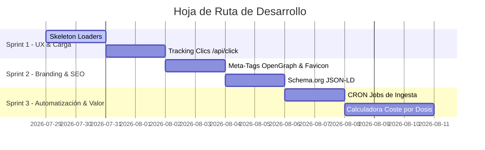

# 🚀 Roadmap de Tareas Pendientes y Propuestas de Valor: Tus Suplementos

> **Documento de Planificación Estratégica y Backlog Técnico**  
> **Proyecto:** Tus Suplementos (`tussuplementos.es`)  
> **Objetivo:** Convertir la plataforma en el comparador n.º 1 de España con UX institucional, SEO agresivo y máxima conversión de afiliación.

---

## 📋 1. Tareas Pendientes del Backlog Actual

### 🟢 Frontend & UX/UI (Javier)
1. **Skeleton Loaders (Carga Suave):**
   - Implementar componentes de carga parpadeante (`animate-pulse`) en `Catalog.tsx` mientras los productos son consultados a la API, eliminando parpadeos bruscos.
2. **Omnibox / Buscador Global en Tiempo Real:**
   - Desplegable inteligente en la barra de navegación que muestre sugerencias visuales instantáneas (con foto, marca y precio) al escribir en la barra de búsqueda.
3. **Badge de Tienda Origen:**
   - Mostrar un distintivo visual claro en cada tarjeta y en el modal ("Disponible en HSN", "Disponible en Farma2go", "Disponible en Bulk") para elevar la confianza del usuario.
4. **Meta-Tags OpenGraph & Favicon:**
   - Generación dinámica de `metadata` OpenGraph (`og:title`, `og:description`, `og:image`) en Next.js App Router para compartir enlaces atractivos en WhatsApp, Twitter y LinkedIn.
5. **Logo Vectorizado (SVG):**
   - Incorporar versiones responsive del logo oficial en variante Light Mode y Dark Mode + `favicon.ico`.

### 🟡 Backend & Datos (Diego)
1. **Endpoint de Tracking de Clics de Afiliado (`POST /api/click`):**
   - Registrar cada clic en el botón "Ver oferta" (ID producto, timestamp, tienda origen, dispositivo) para medir conversiones reales de afiliación.
2. **Automatización de Ingestas (CRON Job):**
   - Configurar tareas programadas en el servidor/Render (1-2 veces al día) para ejecutar automáticamente `hsn.py`, `sportlive.py` y mantener precios/stock sincronizados sin bloqueos.
3. **Fuzzy Search (Búsqueda Tolerante a Errores):**
   - Implementar búsqueda flexible en PostgreSQL (`pg_trgm` o `ilike` mejorado) para tolerar errores tipográficos y tildes (ej: "creatina creapur", "proteina chocolat").

### 🔵 Agregador y Comparación Multi-tienda
1. **Algoritmo de Agrupación Multi-tienda:**
   - Algoritmo en backend para agrupar ofertas del mismo suplemento exacto vendidas en distintas tiendas (ej. HSN vs Farma2go vs Amazon).
2. **Tabla Comparativa de Precios por Tienda:**
   - Vista en modal o ficha donde el usuario vea una tabla ordenada de menor a mayor precio para elegir dónde comprar.

---

## 💡 2. Propuestas Técnicas de Alto Valor (Recomendadas por Experiencia Senior)

Estas 6 funcionalidades elevarán la plataforma a nivel institucional, diferenciándola de competidores genéricos e incrementando la retención de usuarios:

### ⚡ 1. Gráfico de Historial de Precios (Trust & Conversion Signal)
- **Concepto:** Mostrar una gráfica interactiva (con `recharts` o `chart.js`) en la ficha del producto con la evolución de precio de los últimos 30/60/90 días.
- **Impacto:** Demuestra transparencia total y dispara el clic en "Ver oferta" cuando el usuario confirma que el precio está en su mínimo histórico.

### 🧮 2. Calculadora de Coste por Dosis / Toma Real
- **Concepto:** No solo mostrar el `precio_por_kg`, sino el **precio por dosis efectiva** (ej. €0.65 por cazo de 30g de proteína o €0.15 por toma de creatina).
- **Impacto:** Es la métrica que los atletas y compradores habituales realmente usan para decidir sus compras.

### 🏷️ 3. Filtro por Alérgenos y Dietas Específicas
- **Concepto:** Ampliar los filtros con checkboxes para: *Sin Gluten*, *Sin Lactosa*, *Sin Azúcar Añadido*, *Keto Friendly*, *Vegano/Vegetariano*.
- **Impacto:** Resuelve búsquedas con alta intención de compra de usuarios con intolerancias alimentarias.

### 🔔 4. Sistema de "Avísame cuando baje de precio" (Alertas por Email/WhatsApp)
- **Concepto:** Widget en la ficha del producto donde el usuario deja su email o activa notificación para recibir un aviso automático cuando el precio caiga por debajo de una cifra elegida.
- **Impacto:** Captación de leads (base de datos propia de emails) e incremento drástico de visitas recurrentes con intención directa de compra.

### ⚖️ 5. Comparador Lado a Lado (Side-by-Side Matrix)
- **Concepto:** Permitir al usuario marcar hasta 3 productos ("Añadir a comparar") y abrir un modal/pantalla con una tabla comparativa con todos sus datos frente a frente (% proteína, sello, €/kg, precio, formato, valoración).
- **Impacto:** Ayuda decisiva al usuario indeciso para cerrar la compra de inmediato.

### 🗺️ 6. Sitemap XML Dinámico y Marcado Schema.org (`Product` & `Offer`)
- **Concepto:** Generar automáticamente `sitemap.xml` indexando las 1.784 URLs dinámicas (`/producto/[slug]`) e insertar microdatos estructurados JSON-LD (`Schema.org/Product`).
- **Impacto:** Aparecer en los carruseles de Google Shopping y búsquedas orgánicas con precios y estrellas directamente en los resultados de Google.

---

## 🗓️ 3. Hoja de Ruta Sugerida por Sprints

---

> **Nota:** Este documento [`ROADMAP_PENDIENTE.md`](file:///c:/Users/Javier/Desktop/app_suplementos/ROADMAP_PENDIENTE.md) servirá como guía de trabajo activa para las siguientes fases del proyecto.
