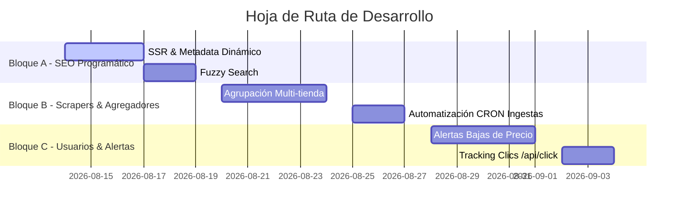

# 🚀 Roadmap de Tareas Pendientes y Propuestas de Valor: Tus Suplementos

> **Documento de Planificación Estratégica y Backlog Técnico**  
> **Proyecto:** Tus Suplementos (`tussuplementos.es`)  
> **Objetivo:** Convertir la plataforma en el comparador n.º 1 de España con UX institucional, SEO agresivo y máxima conversión de afiliación.

---

## ✅ 0. Tareas Completadas Recientemente (Sprint Actual)
1. **Frontend y UX/UI:** Layout natural sin espaciados artificiales, Sanitizador Inteligente de Descripciones (`sanitizeDescription`) y optimización del botón "Leer más" (>230 caracteres). (Completado)
2. **Backend & Telegram Bot:** Script `send_telegram_deals.py` para publicación automática con fotos y formato HTML. Control Anti-Duplicados en PostgreSQL (columna `publicado_telegram`). (Completado)
3. **DevOps & Automatización:** Workflow de GitHub Actions (`telegram_deals.yml`) con ejecución Cron 3 veces al día y GitHub Secrets inyectados. (Completado)
4. **Integraciones & Afiliación:** Webgains (cuenta Particular aprobada) y registro en programas clave (Aldous Bio, Naturecan, AliExpress, etc.). (Completado)
5. **Sitemap XML, OpenGraph, Schema.org & Analítica:** Completados en sprints previos.

---

## 📋 1. Tareas Pendientes del Backlog Estratégico (Re-priorizado)

### 📈 Bloque A: SEO Programático y Crecimiento Orgánico
1. **Rutas Dinámicas SSR y Metadata:** Completar `/producto/[slug]/page.tsx` con SSR (`generateMetadata`) para indexación precisa de cada suplemento.
2. **Páginas de Categoría y Marca:** Endpoints y vistas dinámicas (`/categoria/[slug]` y `/marca/[slug]`) con textos SEO autogenerados.
3. **Fuzzy Search (Búsqueda Tolerante):** Implementar búsqueda flexible en PostgreSQL (`pg_trgm`) para tolerar errores ortográficos en el Omnibox.

### 🕸️ Bloque B: Sistema Avanzado de Ingestión (Scrapers y Agregadores)
1. **Algoritmo de Agrupación Multi-tienda:** Backend capaz de detectar el mismo suplemento exacto en distintas tiendas para fusionarlo en una sola tarjeta ("Disponible desde X€").
2. **Vista Comparativa Lado a Lado:** Modal donde el usuario vea una tabla comparativa de precios por tienda.
3. **Automatización de Ingestas (CRON Job):** Configurar tareas programadas en Render/GitHub Actions para sincronizar precios y stock 1-2 veces al día de forma automática para `hsn.py`, `sportlive.py` y feeds futuros.

### 👤 Bloque C: Conversión, Usuarios y Alertas
1. **Sistema de "Avísame cuando baje de precio":** Alertas personalizadas (email/Telegram) para captación de leads.
2. **Calculadora de Coste por Dosis / Toma Real:** Mostrar el precio por cazo/toma efectiva para atletas.
3. **Tracking de Clics de Afiliado (`POST /api/click`):** Endpoint interno para medir en BBDD qué productos generan más clics salientes (conversión real).
4. **Skeleton Loaders (Carga Suave):** Reemplazar los loadings bruscos por `animate-pulse` en `Catalog.tsx`.

---

## 💡 2. Propuestas Técnicas de Alto Valor (Recomendadas por Experiencia Senior)

Estas 6 funcionalidades elevarán la plataforma a nivel institucional, diferenciándola de competidores genéricos e incrementando la retención de usuarios:

### ⚡ 1. Gráfico de Historial de Precios (Trust & Conversion Signal)
- **Concepto:** Mostrar una gráfica interactiva (con `recharts` o `chart.js`) en la ficha del producto con la evolución de precio de los últimos 30/60/90 días.
- **Impacto:** Demuestra transparencia total y dispara el clic en "Ver oferta" cuando el usuario confirma que el precio está en su mínimo histórico.

### 🧮 2. Calculadora de Coste por Dosis / Toma Real
- **Concepto:** No solo mostrar el `precio_por_kg`, sino el **precio por dosis efectiva** (ej. €0.65 por cazo de 30g de proteína o €0.15 por toma de creatina).
- **Impacto:** Es la métrica que los atletas y compradores habituales realmente usan para decidir sus compras.

### 🏷️ 3. Filtro por Alérgenos y Dietas Específicas
- **Concepto:** Ampliar los filtros con checkboxes para: *Sin Gluten*, *Sin Lactosa*, *Sin Azúcar Añadido*, *Keto Friendly*, *Vegano/Vegetariano*.
- **Impacto:** Resuelve búsquedas con alta intención de compra de usuarios con intolerancias alimentarias.

### 🔔 4. Sistema de "Avísame cuando baje de precio" (Alertas por Email/WhatsApp)
- **Concepto:** Widget en la ficha del producto donde el usuario deja su email o activa notificación para recibir un aviso automático cuando el precio caiga por debajo de una cifra elegida.
- **Impacto:** Captación de leads (base de datos propia de emails) e incremento drástico de visitas recurrentes con intención directa de compra.

### ⚖️ 5. Comparador Lado a Lado (Side-by-Side Matrix)
- **Concepto:** Permitir al usuario marcar hasta 3 productos ("Añadir a comparar") y abrir un modal/pantalla con una tabla comparativa con todos sus datos frente a frente (% proteína, sello, €/kg, precio, formato, valoración).
- **Impacto:** Ayuda decisiva al usuario indeciso para cerrar la compra de inmediato.

---

## 🗓️ 3. Hoja de Ruta Sugerida por Sprints

---

> **Nota:** Este documento [`ROADMAP_PENDIENTE.md`](file:///c:/Users/Javier/Desktop/app_suplementos/ROADMAP_PENDIENTE.md) servirá como guía de trabajo activa para las siguientes fases del proyecto.
